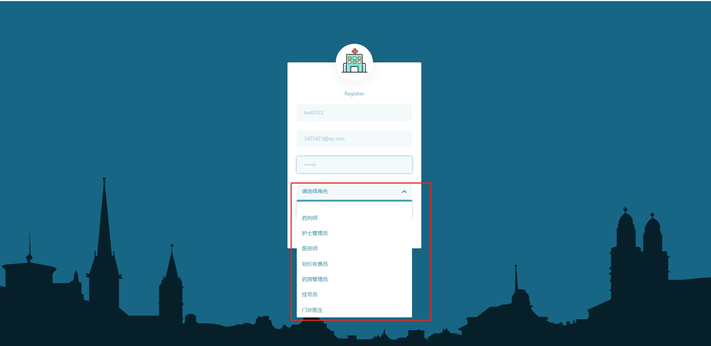
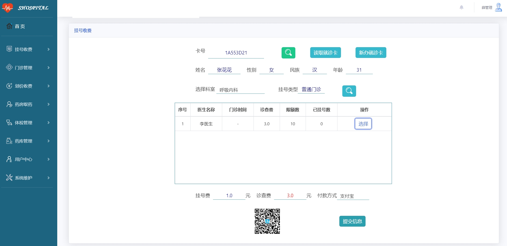
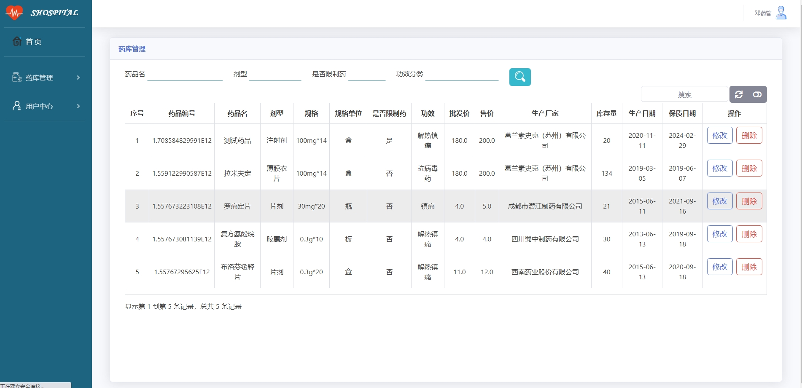
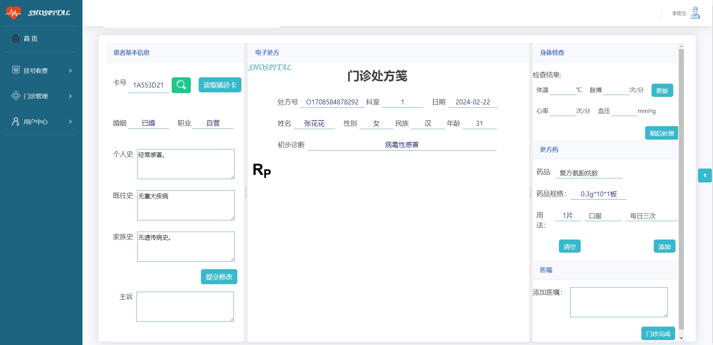
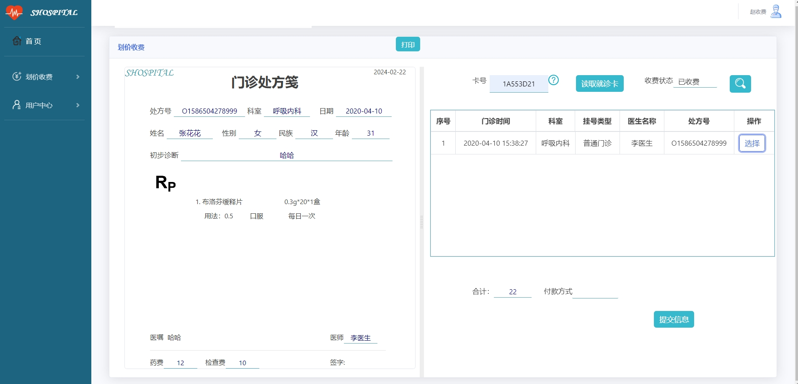

 **郑重声明：项目经过本地测试，确保可以运行， 可以用于学习和毕业设计参考~** 

**扫码 >> 源码商城 获取** 

###1.项目介绍
    这是一套基于SpringBoot的中小型医院信息管理系统，功能开发实现了部分的主要功能。就诊卡提供了手动和读卡两种方式录入，IC读卡器使用的是"德卡D3"，SDK使用的是德卡官网提供的。用户注册为了验证邮件的邮箱考虑到安全问题，暂不提供授权码，如有需求可使用自己邮箱，开启POP3/SMTP服务后，配置到自己项目里。

系统功能有：

- 首页、挂号收费、门诊管理、划价收费、药房取药、体检管理、用户中心、系统维护
- 挂号收费：卡号、就诊卡读取、新办就诊卡、姓名、性别、民族、年龄、选择科室、挂号类型
- 序号、医生名称、门诊时间、诊查费、限额数、已挂号数、挂号费、诊查费、付款方式
- 划价收费、门诊处方栈、处方号、科室、日期、初步诊断
- 普通体检：卡号（急诊卡读取）检查结果、体温、脉搏、心率、血压

#### 2.本地部署

- 创建一个新数据库，导入hisystem.sql文件至数据库中。
- IDEA打开codes目录，安装java依赖包完成后，修改数据库配置，修改路径如下：/codes/src/main/resources/application.yml
- 修改好后点击IDEA里的run运行，一般IDEA安装好相关依赖包后都能自动识别到运行入口模块，入口模块是HisystemApplication。如果能正常访问localhost:8090，就可以对系统做二次开发了。如果不能自动识别运行模块，可以打开HisystemApplication.java文件运行，路径如下：/codes/src/main/java/com/xgs/hisystem/HisystemApplication.java
- 系统有多个角色，角色功能和系统流程和医院一样。角色有：管理员、挂号员、门诊医生、划价收费员、药剂师等，具体可查看his_role表。
- 不同角色的账号密码请查看 **his_user** 表

#### 3系统部分截图

